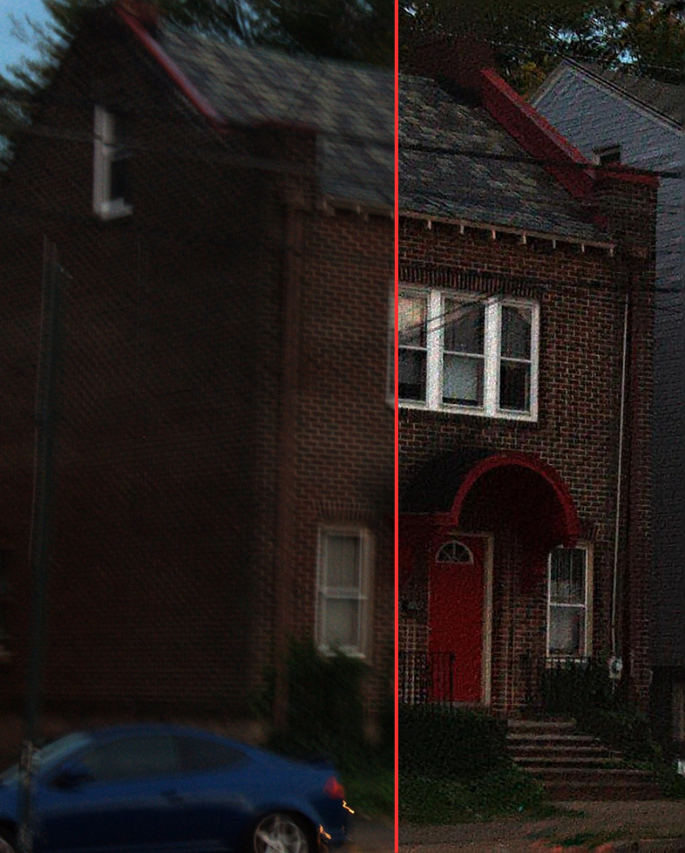

# Image Deblurring Application



A Streamlit-based web application for removing blur from images using advanced blind deconvolution techniques combined with ringing artifact removal.

## Features

- **User-friendly web interface** built with Streamlit
- **Blind deconvolution** algorithm that automatically estimates the blur kernel
- **Ringing artifact removal** to enhance restoration quality
- **Interactive comparison tool** to visualize before/after results
- **Performance metrics** (PSNR, MSE) to evaluate result quality
- **Parameter adjustment** for fine-tuning the deblurring process
- **Result history tracking** with visual graphs

## Technical Approach

This application implements a two-stage deblurring algorithm:

1. **Kernel Estimation**: Using blind deconvolution with multiple image priors (feature, gradient, and dark channel) to estimate the blur kernel (Point Spread Function)
2. **Image Restoration**: Applying ringing artifact removal with total variation and L0 norm constraints to produce a clean, sharp image

## Installation

```bash
pip install -r requirements.txt
```

## Dependencies

- Python 3.6+
- PyTorch
- Streamlit
- NumPy
- Matplotlib
- Pillow (PIL)
- pandas
- streamlit-image-comparison

## Usage

```bash
# Run the Streamlit app
streamlit run app.py
```

The application will start and open in your default web browser. If not, navigate to the URL shown in the terminal (typically http://localhost:8501).

### Using the Application

1. Upload a blurry image using the file uploader
2. Adjust parameters in the sidebar (optional)
3. Click "Start Deblur Process" to begin processing
4. View the results, including the estimated kernel and deblurred image
5. Use the slider to compare before/after results
6. Check performance metrics and history graphs
7. Download the deblurred image or kernel if desired

## Parameters Explanation

| Parameter | Description | Default Value | Range |
|-----------|-------------|---------------|-------|
| Kernel Size | Size of the estimated blur kernel | 29 | 5-101 (odd numbers) |
| Lambda Feature | Weight for feature prior | 3e-4 | 0-0.001 |
| Lambda Dark | Weight for dark channel prior | 0.0 | 0-0.01 |
| Lambda Grad | Weight for gradient prior | 4e-3 | 0-0.01 |
| Lambda TV | Weight for total variation | 0.001 | 0-0.01 |
| Lambda L0 | Weight for L0 norm sparsity | 5e-4 | 0-0.01 |
| Weight Ring | Weight for ringing suppression | 1.0 | 0-10 |


## Performance Metrics

The application calculates two key metrics to evaluate deblurring quality:

- **Mean Square Error (MSE)**: Measures the average squared difference between the original and deblurred images. Lower values indicate better results.
- **Peak Signal-to-Noise Ratio (PSNR)**: Measures the ratio between the maximum possible power of a signal and the power of corrupting noise. Higher values (in dB) indicate better quality.

## Known Limitations

- Works best on images with uniform blur across the entire image
- May struggle with very complex or mixed blur types
- Processing large images may take significant time
- Performance depends on parameter selection which may vary by image

## Acknowledgements

This project implements algorithms based on research in blind deconvolution and image restoration. Key references include:

- [Blind Image Deblurring Using Dark Channel Prior] by [Jinshan Pan]
- [Blind Image Deblurring with FFT-ReLU Sparsity Prior] by [Abdul Mohaimen Al Radi]
